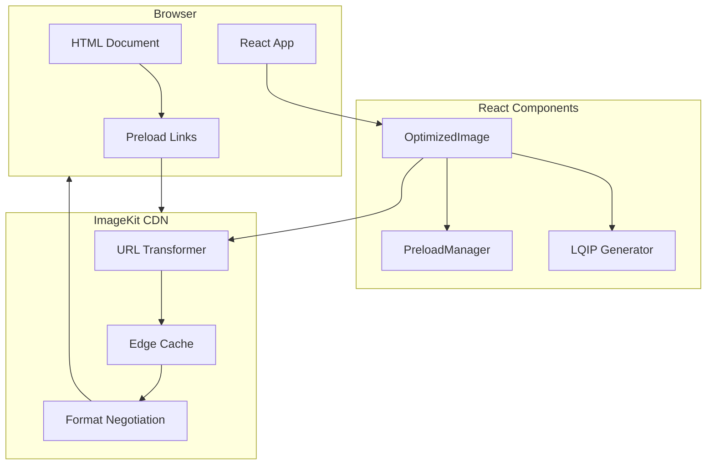
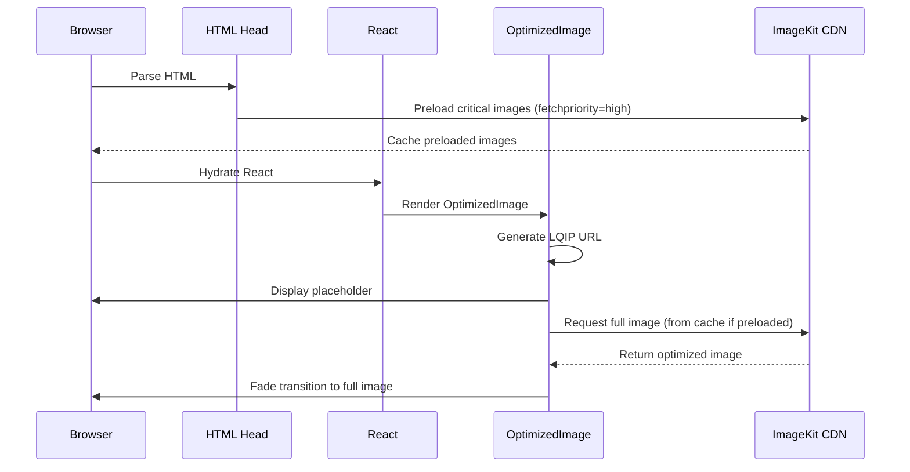
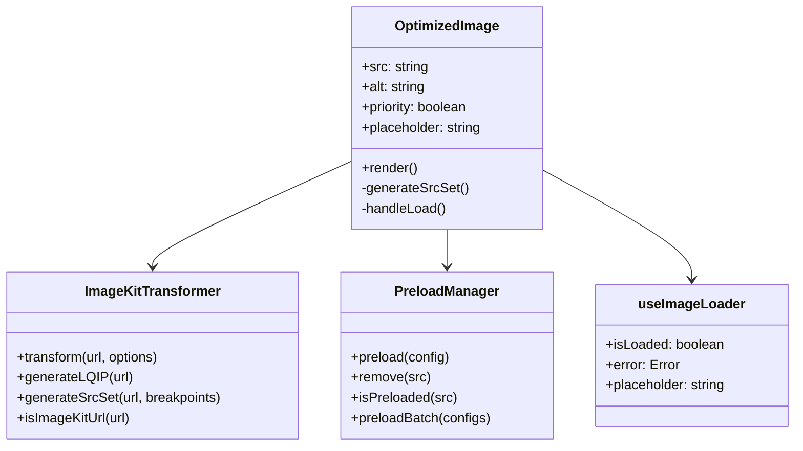

# Design Document: Image Performance Optimization

## Overview

This design document outlines the architecture and implementation approach for optimizing image loading performance on the Aivora portfolio website. The solution leverages modern browser APIs, ImageKit CDN transformations, and React best practices to achieve sub-3-second perceived load times.

The optimization strategy follows a multi-layered approach:
1. **Preloading Layer**: Critical images are preloaded in the document head before React hydrates
2. **Component Layer**: A unified `OptimizedImage` component handles all image optimization logic
3. **CDN Layer**: ImageKit transformations for format conversion, resizing, and quality optimization
4. **Progressive Layer**: LQIP placeholders with smooth transitions for perceived performance

## Architecture



### Data Flow



## Components and Interfaces

### 1. OptimizedImage Component

The core component that replaces the existing `LazyImage` component with enhanced functionality.

```typescript
interface OptimizedImageProps {
  // Required props
  src: string;                    // Image source URL (CDN or local)
  alt: string;                    // Alt text for accessibility
  
  // Dimension props (recommended for CLS prevention)
  width?: number;                 // Intrinsic width
  height?: number;                // Intrinsic height
  
  // Optimization props
  priority?: boolean;             // If true, preload and disable lazy loading
  quality?: number;               // Image quality (1-100), default 80
  placeholder?: 'blur' | 'empty'; // Placeholder type, default 'blur'
  
  // Responsive props
  sizes?: string;                 // Responsive sizes attribute
  breakpoints?: number[];         // Custom breakpoints for srcset
  
  // Styling props
  className?: string;
  style?: React.CSSProperties;
  objectFit?: 'cover' | 'contain' | 'fill' | 'none';
  
  // Event handlers
  onLoad?: () => void;
  onError?: (error: Error) => void;
}
```

### 2. ImageKit URL Transformer

Utility module for generating optimized ImageKit URLs.

```typescript
interface ImageKitOptions {
  width?: number;
  height?: number;
  quality?: number;
  format?: 'auto' | 'webp' | 'avif' | 'jpg' | 'png';
  blur?: number;                  // Blur radius for LQIP
  progressive?: boolean;          // Progressive JPEG
  dpr?: number;                   // Device pixel ratio
}

interface ImageKitTransformer {
  // Transform a CDN URL with optimization parameters
  transform(url: string, options: ImageKitOptions): string;
  
  // Generate LQIP URL (tiny blurred version)
  generateLQIP(url: string): string;
  
  // Generate srcset for responsive images
  generateSrcSet(url: string, breakpoints: number[]): string;
  
  // Check if URL is an ImageKit URL
  isImageKitUrl(url: string): boolean;
}
```

### 3. Preload Manager

Handles injection of preload links into document head.

```typescript
interface PreloadConfig {
  src: string;
  as: 'image';
  type?: string;
  fetchpriority?: 'high' | 'low' | 'auto';
  media?: string;
  imagesrcset?: string;
  imagesizes?: string;
}

interface PreloadManager {
  // Add a preload link to document head
  preload(config: PreloadConfig): void;
  
  // Remove a preload link
  remove(src: string): void;
  
  // Check if image is already preloaded
  isPreloaded(src: string): boolean;
  
  // Preload multiple images with priority ordering
  preloadBatch(configs: PreloadConfig[]): void;
}
```

### 4. Component Hierarchy



## Data Models

### Image Configuration

```typescript
// Critical images configuration for preloading
interface CriticalImage {
  id: string;
  src: string;
  priority: 'high' | 'low';
  type: 'hero' | 'logo' | 'feature';
  breakpoints?: {
    mobile: string;
    tablet: string;
    desktop: string;
  };
}

// Default breakpoints for responsive images
const DEFAULT_BREAKPOINTS = [320, 640, 960, 1280, 1920];

// ImageKit base URL pattern
const IMAGEKIT_PATTERN = /^https:\/\/ik\.imagekit\.io\//;

// Quality presets
const QUALITY_PRESETS = {
  low: 40,      // For LQIP
  medium: 70,   // For mobile
  high: 85,     // For desktop
  max: 100      // For high-DPI displays
};
```

### State Management

```typescript
// Image loading state
interface ImageState {
  status: 'idle' | 'loading' | 'loaded' | 'error';
  placeholderLoaded: boolean;
  fullImageLoaded: boolean;
  error?: Error;
}

// Preload registry (singleton)
interface PreloadRegistry {
  preloaded: Set<string>;
  pending: Map<string, Promise<void>>;
}
```


## Correctness Properties

*A property is a characteristic or behavior that should hold true across all valid executions of a system-essentially, a formal statement about what the system should do. Properties serve as the bridge between human-readable specifications and machine-verifiable correctness guarantees.*

Based on the acceptance criteria analysis, the following correctness properties must be validated through property-based testing:

### Property 1: URL Transformation Completeness

*For any* valid ImageKit URL and transformation options, the transformed URL SHALL contain all required optimization parameters including quality (`q_`), format (`f_auto`), and progressive (`pr-true` for JPEGs).

**Validates: Requirements 1.2, 3.4, 8.3**

### Property 2: LQIP URL Generation

*For any* valid ImageKit URL, the generated LQIP URL SHALL contain width parameter (`w_20` or smaller) and blur parameter (`bl_`) to produce a tiny blurred placeholder.

**Validates: Requirements 2.3**

### Property 3: Aspect Ratio Preservation

*For any* width and height pair where both values are positive numbers, the calculated aspect ratio SHALL equal width divided by height, and the container style SHALL include this exact ratio.

**Validates: Requirements 2.4, 6.3**

### Property 4: Srcset Generation Completeness

*For any* image URL and array of breakpoints, the generated srcset string SHALL contain exactly one entry per breakpoint, each with the correct width descriptor (`{breakpoint}w`).

**Validates: Requirements 4.1**

### Property 5: DPR-Aware Size Calculation

*For any* display width and device pixel ratio (DPR) where both are positive numbers, the calculated image width SHALL equal display width multiplied by DPR.

**Validates: Requirements 4.4**

### Property 6: Lazy Loading Attribute

*For any* image without the priority flag set, the rendered image element SHALL include the `loading="lazy"` attribute.

**Validates: Requirements 5.2**

### Property 7: CDN URL Detection

*For any* URL string, the `isImageKitUrl` function SHALL return true if and only if the URL matches the ImageKit domain pattern (`https://ik.imagekit.io/`).

**Validates: Requirements 6.1**

### Property 8: Priority Image Handling

*For any* image with `priority={true}`, the rendered element SHALL NOT include `loading="lazy"` attribute AND the PreloadManager SHALL be called with the image URL.

**Validates: Requirements 6.2**

### Property 9: Preload Link Attributes

*For any* preload configuration, the generated link element SHALL include `rel="preload"`, `as="image"`, and for the highest priority image, `fetchpriority="high"`.

**Validates: Requirements 1.4, 7.2, 7.3**

### Property 10: Width Transformation Parameter

*For any* breakpoint value in the srcset generation, the corresponding URL SHALL contain the width transformation parameter `w_{breakpoint}`.

**Validates: Requirements 4.3**

## Error Handling

### Network Errors

```typescript
// Error handling strategy for image loading failures
interface ImageErrorHandler {
  // Retry logic with exponential backoff
  maxRetries: 3;
  retryDelays: [1000, 2000, 4000]; // ms
  
  // Fallback behavior
  onMaxRetriesExceeded: (error: Error) => {
    // Show placeholder with error state
    // Log error for monitoring
    // Optionally show fallback image
  };
}
```

### Invalid URLs

- If URL is not a valid ImageKit URL, skip CDN transformations and use original URL
- If URL is malformed, log warning and render nothing (prevent broken images)
- If required props (src, alt) are missing, throw development-time error

### Placeholder Failures

- If LQIP fails to load, show solid color placeholder
- If aspect ratio cannot be calculated (missing dimensions), use default 16:9 ratio
- Graceful degradation: site remains functional even if optimizations fail

## Testing Strategy

### Property-Based Testing

The implementation will use **fast-check** as the property-based testing library for JavaScript/TypeScript.

Each property-based test MUST:
1. Run a minimum of 100 iterations
2. Include a comment referencing the correctness property from this design document
3. Use the format: `**Feature: image-performance-optimization, Property {number}: {property_text}**`

### Test Categories

#### 1. URL Transformer Tests (Property-Based)

```typescript
// Property tests for ImageKit URL transformation
describe('ImageKitTransformer', () => {
  // **Feature: image-performance-optimization, Property 1: URL Transformation Completeness**
  it('should include all optimization parameters for any valid ImageKit URL', () => {
    fc.assert(
      fc.property(
        fc.webUrl(), // Generate random URLs
        fc.record({
          quality: fc.integer({ min: 1, max: 100 }),
          format: fc.constantFrom('auto', 'webp', 'avif'),
        }),
        (url, options) => {
          const result = transformer.transform(url, options);
          // Assert transformation parameters present
        }
      ),
      { numRuns: 100 }
    );
  });
});
```

#### 2. Component Tests (Unit + Property)

- Unit tests for component rendering states
- Property tests for prop handling and output generation
- Integration tests for preload manager interaction

#### 3. Integration Tests

- Verify preload links appear in document head
- Test lazy loading behavior with mock Intersection Observer
- Validate responsive image selection

### Test File Structure

```
src/
├── utils/
│   ├── imagekit-transformer.ts
│   └── imagekit-transformer.test.ts
├── components/
│   └── UI/
│       ├── OptimizedImage.tsx
│       └── OptimizedImage.test.tsx
└── hooks/
    ├── usePreload.ts
    └── usePreload.test.ts
```

### Coverage Requirements

- All correctness properties must have corresponding property-based tests
- Critical paths (URL transformation, preloading) require 100% branch coverage
- Component tests should cover all prop combinations
